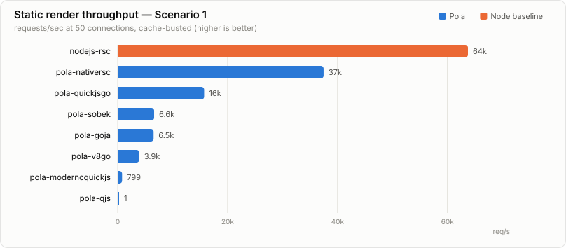
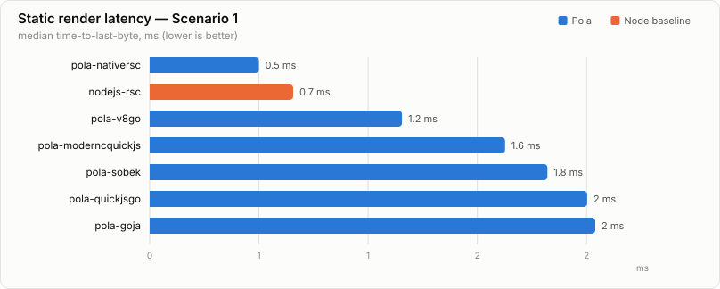
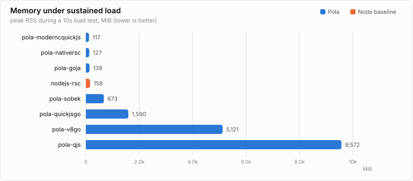
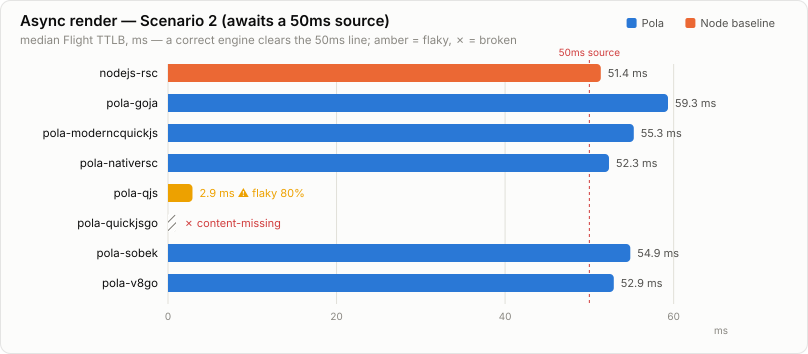
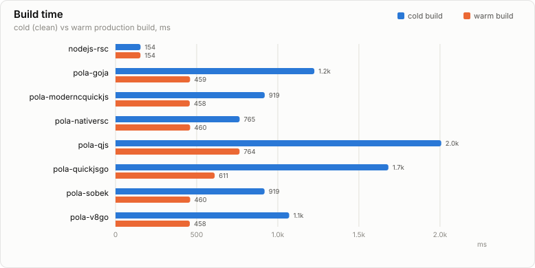
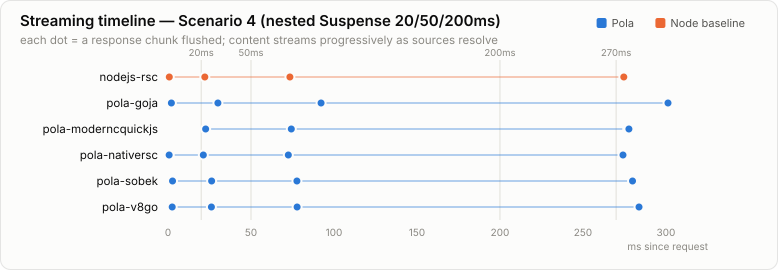

# Benchmark charts

> Generated by `node charts.mjs` from `results/summary.json`. Do not hand-edit.
> Environment: Apple M5 Pro, 18 cores, 48 GiB, macOS 26.4 (25E246) · Node v24.15.0 · 7 runs (drop 2), 10s load.
> **Blue = Pola engines, orange = Node.js baselines.** No winner is declared; read `FAIRNESS.md` for caveats (Pola's two-request model, cache-busting, the async correctness gate).

## Static render throughput

## Static render latency

## Memory under load

## Async correctness (50ms source)

## Build time

## Streaming timeline (nested Suspense)

